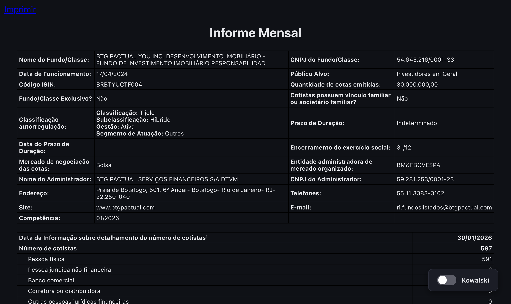
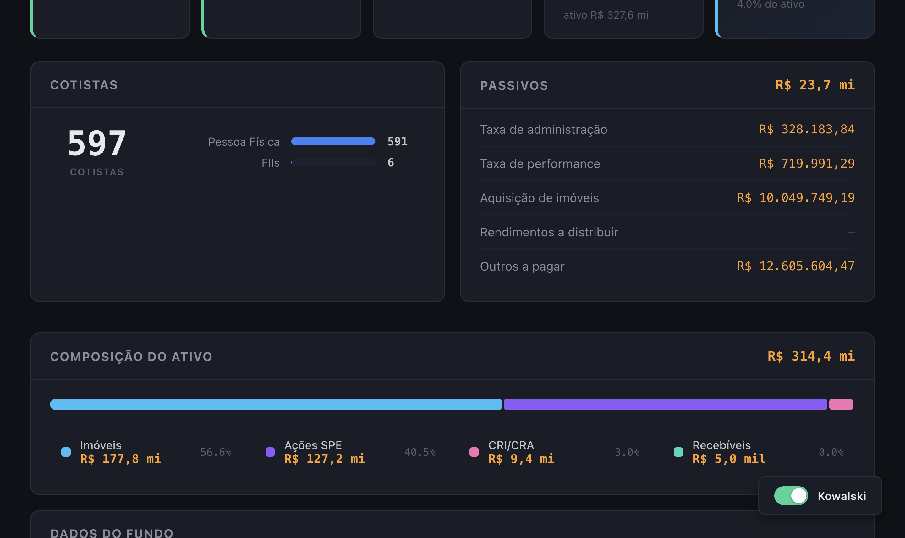
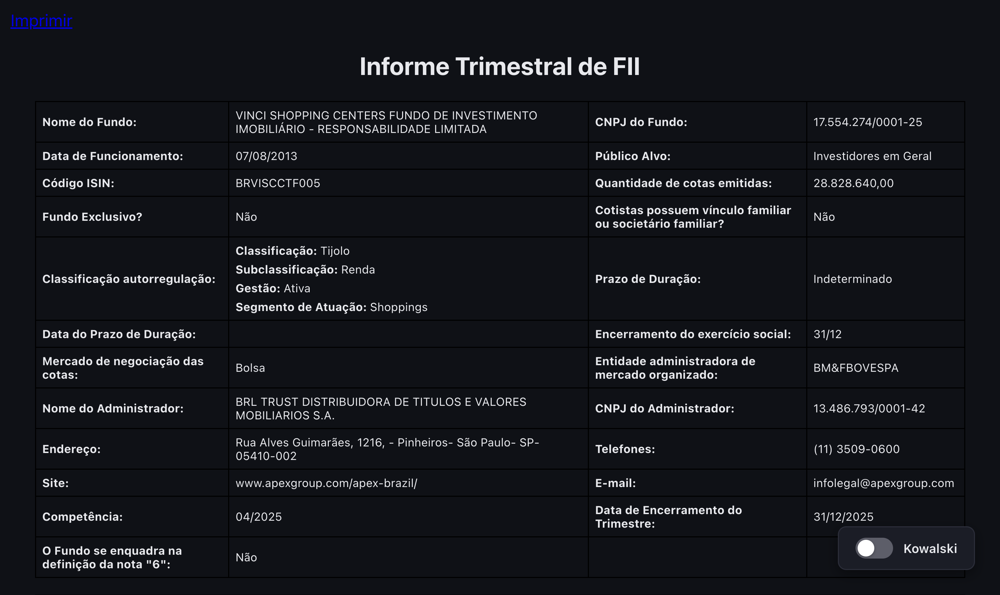
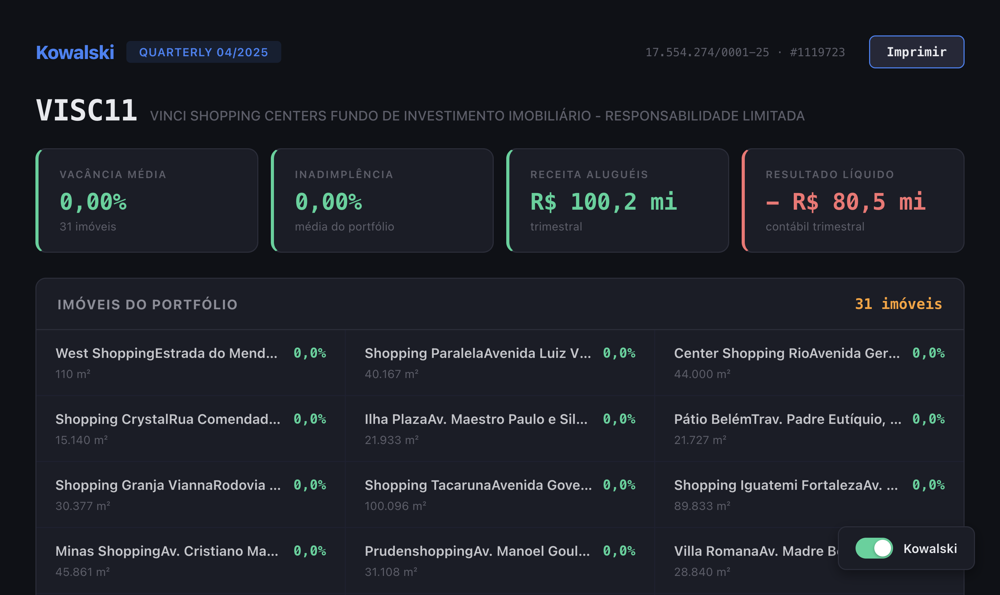
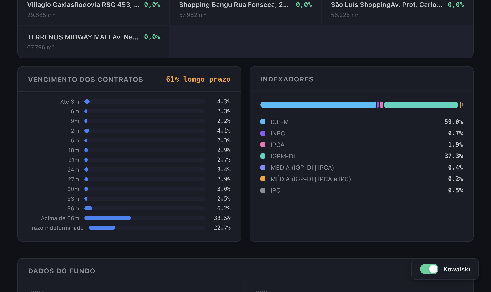
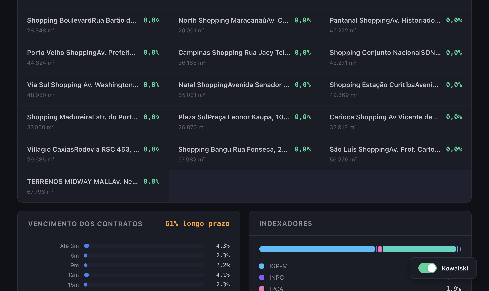

<p align="center">
  
</p>

<h1 align="center">Kowalski</h1>

<p align="center">Extensão Chrome que transforma os relatórios do FNET/CVM de FIIs (Fundos de Investimento Imobiliário) em um dashboard moderno e legível.</p>

## Relatórios Mensais

**Antes** — tabelas cruas do FNET, densas e difíceis de ler:



**Depois** — Kowalski extrai os KPIs, destaca o que importa e apresenta os dados visualmente:



## Relatórios Trimestrais

**Antes** — páginas de tabelas aninhadas com dados de imóveis, contratos e demonstrações financeiras:



**Depois** — taxa de vacância, receita de aluguéis, grid de imóveis, barras de vencimento de contratos e distribuição de indexadores em um olhar:







## Funcionalidades

- **Ticker automático** a partir do código ISIN (ex: `BRVISCCTF005` vira `VISC11`)
- **Relatórios mensais**: dividend yield, rentabilidade, taxa de administração, PL, caixa, gráfico de cotistas, detalhamento de passivos, composição do ativo
- **Relatórios trimestrais**: vacância e inadimplência por imóvel, receita de aluguéis, resultado líquido, grid de imóveis, distribuição de vencimento de contratos, indexadores (IGP-M, IPCA, etc.)
- **Toggle** para alternar entre a visão Kowalski e o relatório original
- **Tema escuro** inspirado no Bloomberg Terminal — Inter + JetBrains Mono, alto contraste, sinais visuais por cor

## Instalação

```bash
git clone https://github.com/geeksilva97/kowalski.git
cd kowalski
pnpm install
cd apps/extension && node build.ts
```

Depois carregue no Chrome:

1. Acesse `chrome://extensions`
2. Ative o **Modo de desenvolvedor**
3. Clique em **Carregar sem compactação**
4. Selecione a pasta `apps/extension/dist`
5. Navegue até qualquer relatório no [FNET](https://fnet.bmfbovespa.com.br)

## Stack

| Camada | Tecnologia |
|---|---|
| Extensão | TypeScript + esbuild (Manifest V3) |
| API | Hono no Node.js |
| Web | Astro |
| Parser | linkedom (compartilhado entre extensão e API) |
| Monorepo | Turborepo + pnpm |
| Testes | node:test + Vitest (85 testes) |
| Runtime | Node.js 24+ com TypeScript nativo |

## Estrutura

```
apps/
  extension/   Extensão Chrome (content script + CSS)
  api/         Servidor API Hono
  web/         Dashboard Astro
packages/
  parser/      HTML do FNET → dados estruturados
  types/       Interfaces TypeScript compartilhadas
```
